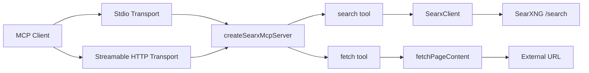
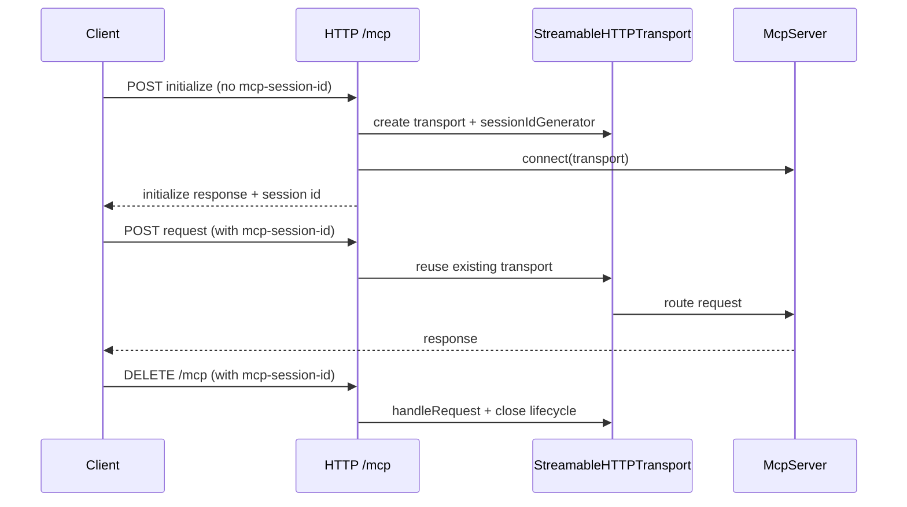

# AGENTS.md

> Consolidated assistant guide for this repository.
> Audience: AI coding assistants and automation agents working on this codebase.

## Table of Contents

- [How to Use This File](#how-to-use-this-file) - Context-loading strategy for assistants.
- [Project Snapshot](#project-snapshot) - Purpose, scope, and runtime model.
- [Architecture](#architecture) - Component map and data flow.
- [Directory Map](#directory-map) - File-level responsibilities.
- [Tool Interfaces](#tool-interfaces) - MCP tools, schemas, and behavior contracts.
- [Configuration Model](#configuration-model) - Required/optional env vars and safety rules.
- [Operational Workflows](#operational-workflows) - Build, run, verify, and debug loops.
- [Dependencies](#dependencies) - External libraries and why they exist.
- [Coding Standards](#coding-standards) - Local conventions and design constraints.
- [Testing and Verification](#testing-and-verification) - Current quality gates and gaps.
- [Contribution Guidance](#contribution-guidance) - Expected PR behavior and guardrails.
- [Known Risks and Improvement Backlog](#known-risks-and-improvement-backlog) - Practical next improvements.

## How to Use This File

<!-- metadata: audience=ai-assistant; priority=high; topics=entrypoint,planning,navigation -->

Use this file as the primary context entrypoint.

Recommended assistant workflow:

1. Read `Project Snapshot` and `Architecture`.
2. Jump to `Tool Interfaces` when changing tool behavior.
3. Jump to `Configuration Model` for startup, env, or deployment issues.
4. Use `Operational Workflows` for build/run troubleshooting.
5. Use `Known Risks and Improvement Backlog` before proposing refactors.

## Project Snapshot

<!-- metadata: audience=ai-assistant; priority=high; topics=purpose,scope -->

This repository implements a TypeScript MCP server backed by a SearXNG instance.

Primary capabilities:

- `search`: queries SearXNG and returns normalized, structured results plus readable text.
- `fetch`: retrieves and sanitizes URL content for LLM consumption.

Transports:

- `stdio` (`src/index.ts`) for local MCP clients.
- Streamable HTTP (`src/http.ts`) with stateful session handling.

Runtime profile:

- Node.js `>=18`
- ESM modules (`"type": "module"`)
- Strict TypeScript build to `dist/`

## Architecture

<!-- metadata: audience=ai-assistant; priority=high; topics=system-design,flow -->



HTTP session lifecycle:



Design rules:

- Tool logic is transport-agnostic and centralized in `src/server.ts`.
- Config is validated before startup in `src/config.ts`.
- HTTP route handlers are guarded by host/origin/auth middleware.

## Directory Map

<!-- metadata: audience=ai-assistant; priority=high; topics=file-ownership -->

```text
src/
  config.ts           Environment parsing/validation and defaults
  searx-client.ts     SearXNG query client and response normalization
  content-fetcher.ts  URL retrieval, HTML sanitization, truncation logic
  server.ts           MCP server factory and tool registration
  index.ts            stdio entrypoint
  http.ts             Streamable HTTP entrypoint (GET/POST/DELETE /mcp)

skills/
  using-searxng-mcp/SKILL.md   LLM usage playbook for search/fetch decisions

Root:
  package.json
  tsconfig.json
  README.md
  .env.example
  LICENSE
```

## Tool Interfaces

<!-- metadata: audience=ai-assistant; priority=high; topics=api-contracts,mcp-tools -->

### Tool: `search`

Input schema:

- `query` (required string)
- `pageno` (optional positive int)
- `language` (optional string)
- `categories` (optional comma-separated string)
- `safesearch` (optional int 0..2)
- `timeRange` (optional enum: `day|month|year`)
- `limit` (optional int 1..10, default 5)

Output behavior:

- Returns `content` (formatted text summary) and `structuredContent`.
- `structuredContent` fields:
    - `query`
    - `answer?`
    - `suggestions[]`
    - `results[]` where each result includes `title`, `url`, `content`, `engine`, `score?`

Failure behavior:

- Returns `{ isError: true, content: [{ type: "text", text: ... }] }`.
- Backend failures include timeout, non-OK SearXNG response, or unexpected fetch errors.

### Tool: `fetch`

Input schema:

- `url` (required absolute URL)

Output behavior:

- Returns `content` (sanitized page text) and `structuredContent`.
- `structuredContent` fields:
    - `url` (resolved URL)
    - `contentType`
    - `content`
    - `truncated` (boolean)

Failure behavior:

- Returns tool error payload with `isError: true`.
- Typical causes: timeout, non-OK status, or unsupported response characteristics.

## Configuration Model

<!-- metadata: audience=ai-assistant; priority=high; topics=env,security,startup -->

All env parsing is centralized in `src/config.ts`.

Required:

- `SEARXNG_BASE_URL` (must be valid URL)

Optional with defaults:

- `SEARXNG_TIMEOUT_MS` default `15000`
- `FETCH_TIMEOUT_MS` default `10000`
- `FETCH_MAX_BYTES` default `500000`
- `HTTP_PORT` default `3100`
- `HTTP_BIND` default:
    - `127.0.0.1` outside production
    - `0.0.0.0` in production

Optional JSON strings:

- `SEARXNG_HEADERS` -> object string map
- `HTTP_ALLOWED_ORIGINS` -> array of origins
- `HTTP_ALLOWED_HOSTS` -> array of allowed hostnames

Conditional security constraint:

- If `HTTP_BIND` is not local (`127.0.0.1|localhost|::1`), `HTTP_AUTH_TOKEN` is required.

Startup note:

- Both entrypoints import `dotenv/config`, so `.env` is auto-loaded at runtime.

## Operational Workflows

<!-- metadata: audience=ai-assistant; priority=medium; topics=commands,debugging -->

Build:

```bash
npm run build
```

Run stdio server:

```bash
npm start
```

Run HTTP server:

```bash
npm run start:http
```

Health check:

```bash
curl http://127.0.0.1:3100/health
```

Common failure signatures:

- `SEARXNG_BASE_URL` missing -> config validation error at startup.
- MCP client starts server without env -> pass env directly in client config or set `cwd` to repo root.
- HTTP bind non-local without token -> explicit startup error from `loadConfig()`.

## Dependencies

<!-- metadata: audience=ai-assistant; priority=medium; topics=libraries -->

Runtime:

- `@modelcontextprotocol/sdk` - MCP server, transports, and protocol utilities.
- `express` - HTTP app and middleware routing.
- `zod` - schema validation for config and tool schemas.
- `dotenv` - `.env` autoloading.

Dev:

- `typescript` - compilation and type-checking.
- `tsx` - development runner for TS entrypoints.
- `@types/node`, `@types/express` - type support.

## Coding Standards

<!-- metadata: audience=ai-assistant; priority=medium; topics=style,patterns -->

Observed conventions:

- ESM imports with explicit `.js` extension for local TS modules.
- Keep modules focused by concern:
    - config
    - transport
    - client integration
    - content extraction
- Prefer defensive error wrapping with domain-specific error classes.
- Keep tool outputs both human-readable (`content`) and machine-usable (`structuredContent`).
- Avoid embedding secrets or local personal values in tracked files.

Do not:

- hardcode environment-specific URLs or credentials
- bypass config validation in `loadConfig()`
- duplicate tool registration across transports

## Testing and Verification

<!-- metadata: audience=ai-assistant; priority=medium; topics=quality,verification -->

Current state:

- No automated test suite committed.

Current quality gates:

- `npm run build`
- runtime smoke tests (`npm start`, `npm run start:http`, `/health`)
- manual MCP validation of `search` and `fetch`

Recommended additions:

- unit tests for `loadConfig()`
- unit tests for `SearxClient.search()` (query params + error mapping)
- unit tests for `fetchPageContent()` sanitization/truncation
- integration tests for HTTP session lifecycle and auth/origin/host guards

## Contribution Guidance

<!-- metadata: audience=ai-assistant; priority=medium; topics=pr,maintenance -->

When proposing changes:

1. Keep docs and code in English.
2. Maintain separation between transport and tool logic.
3. Update `README.md` if behavior or configuration changes.
4. Preserve privacy constraints:
    - keep real values in local `.env`
    - use placeholders in committed examples
5. Run build verification before claiming completion.

Preferred change strategy for assistants:

- small, scoped patches
- preserve existing behavior unless user asks for behavior change
- include migration notes when touching MCP transport or tool schemas

## Known Risks and Improvement Backlog

<!-- metadata: audience=ai-assistant; priority=low; topics=roadmap,tech-debt -->

- Add automated tests for core modules and HTTP flow.
- Consider SDK package split migration (`@modelcontextprotocol/server` etc.) if needed.
- Improve fetch support for non-HTML content types (optional future feature).
- Add optional retries/backoff strategy for transient upstream failures.
- Add CI pipeline for build and lint checks.
