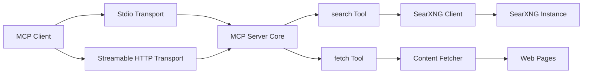

# SearXNG MCP Server

[](https://nodejs.org/)
[](./LICENSE)

An open-source Model Context Protocol (MCP) server that connects to a SearXNG instance and exposes web search capabilities to LLM clients.

This project provides two MCP tools:

- `search`: runs web search via SearXNG and returns structured + readable output
- `fetch`: loads a URL and extracts readable page content

Supported transports:

- `stdio` for local clients (Cursor, Claude Desktop, local agent runtimes)
- Streamable HTTP for remote clients (ChatGPT and Claude remote connectors)

## Why this project?

Most MCP search servers depend on third-party providers or fixed integrations.
This project is built for users who run their own SearXNG instance and want:

- privacy-friendly web search under their own control
- one MCP server that works both locally and remotely
- small, understandable TypeScript code that is easy to extend

## Quick Start

```bash
npm install
cp .env.example .env
# edit .env and set SEARXNG_BASE_URL
npm run build
npm start
```

For HTTP mode:

```bash
npm run start:http
```

## Technology Stack

- **Language:** TypeScript
- **Runtime:** Node.js `>=18`
- **MCP SDK:** `@modelcontextprotocol/sdk` (`^1.27.1`)
- **HTTP server:** Express (`^5.2.1`)
- **Validation:** Zod (`^4.3.6`)
- **Environment loader:** dotenv (`^17.3.1`)
- **Dev runner:** `tsx`
- **Build:** `tsc` (TypeScript compiler)

## Project Architecture



Key architecture decisions:

- **Single server factory:** `createSearxMcpServer()` defines tools once.
- **Dual transport entrypoints:** `src/index.ts` (stdio) and `src/http.ts` (HTTP).
- **Stateful HTTP sessions:** `mcp-session-id` mapped to reusable transport/session state.
- **Security middleware:** host/origin checks + optional bearer token auth.

## Getting Started

### Prerequisites

- Node.js 18+
- A reachable SearXNG instance with JSON response format enabled (`format=json`)

### Installation

```bash
npm install
```

### Configuration

Copy `.env.example` to `.env` and set at least:

```env
SEARXNG_BASE_URL=https://your-searxng.instance
```

`dotenv` is loaded automatically, so `npm start` reads `.env` with no extra shell exports.

### Build

```bash
npm run build
```

### Run

Start stdio server:

```bash
npm start
```

Start HTTP server:

```bash
npm run start:http
```

Health check:

```bash
curl http://127.0.0.1:3100/health
```

## Project Structure

```text
src/
  config.ts           # env parsing and validation
  searx-client.ts     # SearXNG API calls + response normalization
  content-fetcher.ts  # URL loading + readable text extraction
  server.ts           # MCP tool registration (search, fetch)
  index.ts            # stdio entrypoint
  http.ts             # Streamable HTTP entrypoint
```

Additional files:

- `.env.example` - safe template for runtime config
- `.gitignore` - excludes secrets and build artifacts
- `LICENSE` - MIT license text

## Key Features

- MCP tool: `search`
    - input controls: `query`, `pageno`, `language`, `categories`, `safesearch`, `timeRange`, `limit`
    - output includes readable text and structured data
- MCP tool: `fetch`
    - retrieves URL content
    - strips HTML noise and truncates safely by byte budget
- Streamable HTTP support with:
    - `POST /mcp`
    - `GET /mcp`
    - `DELETE /mcp`
    - `GET /health`
- HTTP safety defaults:
    - localhost bind by default
    - optional host and origin allowlists
    - optional bearer auth (required when exposing non-local bind)

## Environment Variables

| Variable               | Required    | Description                                                |
| ---------------------- | ----------- | ---------------------------------------------------------- |
| `SEARXNG_BASE_URL`     | Yes         | Base URL of your SearXNG instance.                         |
| `SEARXNG_HEADERS`      | No          | JSON object with additional headers for SearXNG requests.  |
| `SEARXNG_TIMEOUT_MS`   | No          | Search timeout in ms. Default: `15000`.                    |
| `FETCH_TIMEOUT_MS`     | No          | URL fetch timeout in ms. Default: `10000`.                 |
| `FETCH_MAX_BYTES`      | No          | Max response bytes returned by `fetch`. Default: `500000`. |
| `HTTP_PORT`            | No          | Streamable HTTP port. Default: `3100`.                     |
| `HTTP_BIND`            | No          | Bind address. Default local: `127.0.0.1`.                  |
| `HTTP_ALLOWED_ORIGINS` | No          | JSON array of allowed `Origin` headers.                    |
| `HTTP_ALLOWED_HOSTS`   | No          | JSON array of allowed `Host` values.                       |
| `HTTP_AUTH_TOKEN`      | Conditional | Required when `HTTP_BIND` is not local.                    |

Use `.env.example` as the canonical template.

## Development Workflow

Current workflow:

1. Implement/adjust logic in `src/`
2. Build with `npm run build`
3. Smoke test:
    - `npm start` for stdio
    - `npm run start:http` and check `/health`
4. Validate behavior with real MCP calls (`search` and `fetch`)

Suggested collaborative workflow:

- use feature branches
- open pull requests for review
- tag versions for release milestones

## Coding Standards

Conventions used by this codebase:

- strict TypeScript enabled
- explicit runtime validation for untrusted input (`zod`)
- small modules with clear responsibilities
- fail-fast behavior for invalid environment configuration
- clear error messages and deterministic defaults
- no secrets or personal values in tracked files

## Testing

Automated tests are not included yet.

Current validation method:

- compile-time check: `npm run build`
- runtime smoke checks for both transports
- manual functional checks of `search` and `fetch`

Recommended next step:

- add unit tests for:
    - `loadConfig` in `src/config.ts`
    - request/response handling in `src/searx-client.ts`
    - extraction and truncation in `src/content-fetcher.ts`
    - session/security behavior in `src/http.ts`

## Contributing

Contributions are welcome.

Please follow these rules:

- keep code and docs in English
- do not commit `.env` files or secrets
- keep examples generic (no personal domains, usernames, or tokens)
- run `npm run build` before opening a PR
- keep changes scoped and documented

## Security and Privacy

- `.env` is ignored by git and must stay local.
- Store real tokens, instance URLs, and private headers only in `.env`.
- Use placeholders in committed docs and examples.

## License

This project is licensed under the [MIT License](./LICENSE).
